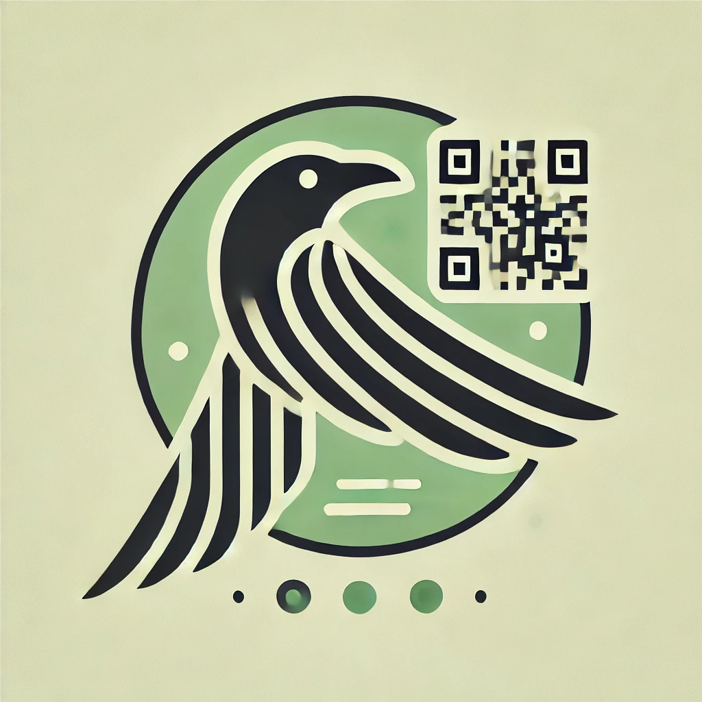

# QRaven API

    

This is a sample QRaven API built with Go.

## Built with

- [Go](https://golang.org/) - The programming language used
- [Gin](https://) - The web framework used
- [Gorm](https://) - The ORM used
- [PostgreSQL](https://) - The database used
- [Redis](https://) - The caching server used
