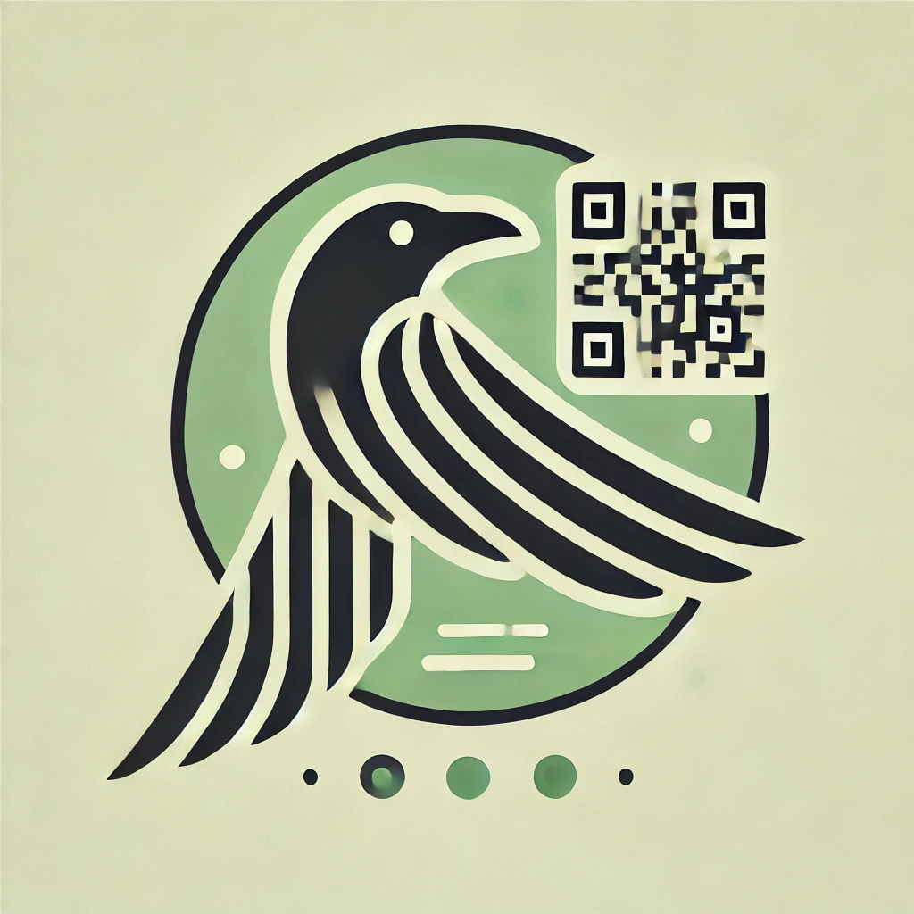

# QRaven API

<div align="center">
    
</div>

QRaven is an event platform backend built with Go. It supports authentication, event management, ticket issuance, and payment initialization/status updates, with richer notifications planned as the next major capability.

## What this project is today

### Implemented and wired
- API server with Gin, middleware stack, metrics endpoint, and Swagger UI wiring.
- JWT-based auth for register/login and role-based authorization (User, Organizer, Admin).
- Event lifecycle endpoints (create, list, get, update, delete).
- Ticket creation/listing with capacity updates and persistence.
- Payment initialization, retrieval, and status update endpoints wired to ticket status lifecycle.
- PostgreSQL + Redis connections, startup migrations, and scheduled cleanup job for expired tokens.

### Present but not fully wired
- Notification service includes token cleanup and push helper, but no full end-user notification workflow yet.
- Legacy Swagger artifacts still exist under `static/` and `cmd/api/docs/`, but runtime now serves canonical docs from `docs/`.

## What this project is meant to become

QRaven is intended to become a production-ready event operations backend with:
- Reliable event publishing and discovery.
- End-to-end ticketing with payment confirmation.
- Notification workflows (booking updates, reminders, organizer alerts).
- Stable API documentation and stronger test coverage for all core domains.

## How to get there

### Phase 1: Stabilize the current foundation
1. Make `docs/swagger.yaml` and `docs/swagger.json` the canonical API contract and align generated/static docs.
2. Add a committed local infrastructure definition (`compose.yaml`) so `make docker-run` is fully plug-and-play.
3. Standardize configuration loading (single source of truth for `app`/environment behavior).

### Phase 2: Complete core product flows
1. Expose payment endpoints and connect payment status to ticket lifecycle.
2. Wire notification service into ticket/payment events.
3. Add API-level tests for event and ticket domains (auth tests already exist).

### Phase 3: Production hardening
1. Improve observability and operational docs (runbooks, failure modes, metrics usage).
2. Expand security checks and role-policy validation coverage.
3. Add CI automation for tests, linting, and Swagger consistency checks.

## Architecture at a glance

- `cmd/api/main.go`: application bootstrap (config, DB/Redis, migrations, cron, server start).
- `pkg/router/*`: route registration by domain (`auth`, `event`, `ticket`, `payment`).
- `pkg/controller/*`: HTTP handlers and request/response orchestration.
- `services/*`: business logic layer.
- `internal/models/*`: data models and migration definitions.
- `pkg/repository/storage/*`: PostgreSQL/Redis data-access abstraction.
- `pkg/middleware/*`: authz, metrics, CORS, and security middleware.

## Current API surface

Base path: `/api/v1`

- Auth
    - `POST /auth/register`
    - `POST /auth/login`
- Events
    - `POST /events/` (Organizer)
    - `GET /events/` (User, Organizer, Admin)
    - `GET /events/:id` (User, Organizer, Admin)
    - `PUT /events/:id` (Organizer)
    - `DELETE /events/:id` (Organizer)
- Tickets
    - `POST /tickets/:eventId` (User, Organizer, Admin)
    - `GET /tickets/` (User, Organizer, Admin)
- Payments
    - `POST /payments/initialize` (User, Organizer, Admin)
    - `GET /payments/:id` (User, Organizer, Admin)
    - `PATCH /payments/:id/status` (User, Organizer, Admin)

Also available:
- `GET /metrics` (Prometheus)
- `GET /swagger/*any` (Swagger UI)

## Tech stack

- [Go](https://golang.org/)
- [Gin](https://gin-gonic.com/)
- [GORM](https://gorm.io/)
- [PostgreSQL](https://www.postgresql.org/)
- [Redis](https://redis.io/)
- [Viper](https://github.com/spf13/viper)
- [Swagger / Swag](https://github.com/swaggo/swag)

## Running locally (Docker Compose first)

### Prerequisites
- Go 1.22.5+
- Docker + Docker Compose

### 1) Start dependencies

The Makefile expects a Compose project:

```bash
make docker-run
```

`compose.yaml` is committed with PostgreSQL + Redis defaults and works directly with `make docker-run`.

### 2) Configure application values

The app uses Viper with environment fallback. Use environment variables (recommended) or an `app.env` file if your local workflow depends on it.

Minimum variables to run:

```env
APP_NAME=QRaven
APP_MODE=debug
APP_URL=http://localhost:8080

SERVER_PORT=8080
SERVER_SECRET=replace-with-a-strong-secret
SERVER_ACCESSTOKENEXPIREDURATION=24
REQUEST_PER_SECOND=5
TRUSTED_PROXIES=[]
EXEMPT_FROM_THROTTLE=[]

DB_HOST=127.0.0.1
DB_PORT=5432
DB_CONNECTION=postgres
USERNAME=postgres
PASSWORD=postgres
DB_NAME=qraven
SSLMODE=disable
TIMEZONE=Africa/Lagos
MIGRATE=true

REDIS_HOST=127.0.0.1
REDIS_PORT=6379
REDIS_DB=0
```

Optional (only if using image upload / payment code paths):

```env
CLOUDINARY_CLOUD_NAME=
CLOUDINARY_API_KEY=
CLOUDINARY_API_SECRET=
PAYSTACK_SECRET_KEY=
```

### 3) Run the API

```bash
make run
```

### 4) Build the binary

```bash
make build
```

### 5) Run tests

```bash
make test
```

## API documentation

Canonical docs live in:
- `docs/swagger.yaml`
- `docs/swagger.json`

Swagger UI serves the canonical spec from `docs/swagger.yaml` at runtime.

Regenerate after route/handler changes:

```bash
make swagger
```

## Known gaps and technical debt

- Notification user workflows are not yet wired to ticket/payment business events.
- Legacy Swagger outputs in `static/` and `cmd/api/docs/` should be removed in a cleanup PR after consumers are fully moved.
- Test suite is currently strongest in auth; event/ticket/payment/notification test coverage is still thin.

## Contribution focus (recommended next PRs)

1. Wire notification service to ticket/payment lifecycle events.
2. Add event/ticket/payment integration tests and failure-path coverage.
3. Remove legacy Swagger artifacts under `static/` and `cmd/api/docs/`.
4. Harden role-policy checks and negative-path coverage.

## Deploying to Render (Docker)

This repository includes:
- `Dockerfile`
- `render.yaml`

### 1) Create service from Blueprint

In Render, create a new Blueprint and point it to this repository. Render will use `render.yaml`.

### 2) Set required environment values

`render.yaml` includes defaults and placeholders. You must set secrets and external service values:

- `SERVER_SECRET`
- `DB_HOST`, `DB_PORT`, `USERNAME`, `PASSWORD`, `DB_NAME`
- `REDIS_HOST`, `REDIS_PORT`
- `PAYSTACK_SECRET_KEY` (if payment initialization is enabled)

For external Postgres/Redis, keep `DB_CONNECTION=postgres`, set `SSLMODE=require`, and ensure network access from Render.

### 3) Migration behavior

`MIGRATE=false` is the default in `render.yaml`. Enable it intentionally when you want boot-time migrations.

### 4) Health check

Render health check path is `/api/v1/`.
